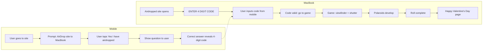

# Valentine's Day "Pokemon Snap" Web App – Plan

## Complexity: **Moderate**

- **Simple**: One responsive web app, static content, viewfinder + click, final landing page.
- **Medium**: Mobile flow (airdrop prompt → confirm → question → code) and MacBook code entry; shutter flash + polaroid develop animation, photo roll state.
- **No heavy backend required**; one 4-digit code and one question/answer in config.

---

## High-level flow

---

## 1. "Send to MacBook" flow (AirDrop + 4-digit code)

- **Mobile (user goes to site)**  
  1. Site prompts: **AirDrop this site to your MacBook** (instructions and/or a share button so the user can AirDrop the current URL to the MacBook).  
  2. User taps **"Yes, I've airdropped"** (or similar) to confirm.  
  3. The site then shows **a question** to the user (one question, configurable in the app).  
  4. When the user answers **correctly**, the **4-digit code** appears so they can type it on the MacBook.

- **MacBook (airdropped site opens)**  
  - The same site URL, when opened on the MacBook (e.g. after AirDrop), shows **"ENTER 4 DIGIT CODE"** and an input.  
  - User enters the code they see on mobile.  
  - If the code matches the expected value, the app navigates to the game; otherwise show an error and let them try again.

- **Code**  
  - **No backend**: Use a single 4-digit code (e.g. in config or derived from a secret). Mobile reveals it after the correct answer; MacBook validates the input against the same value. Same app, same logic; device or route can decide whether to show the mobile flow (prompt to airdrop, confirm, question, show code) or the MacBook flow (enter code, then game).

---

## 2. Tech stack (lightweight, both platforms)

- **React + Vite** – single codebase, small bundle, great for static deploy. Avoid Angular for this size; React keeps it lighter.
- **React Router** – routes:  
  - **Mobile flow** at `/`: airdrop prompt → confirm → question → show 4-digit code.  
  - **MacBook flow**: same origin; when opened on desktop, show "ENTER 4 DIGIT CODE" then **Game** (viewfinder + shutter + polaroids).  
  - **Final** at `/valentines` ("Happy Valentine's Day" with flowers/hearts).
- **CSS** (or Tailwind if you prefer) for layout, viewfinder, flash, polaroid frame, and final page. No need for a heavy UI library.
- **Mobile-first responsive** – gate and final page work on small screens; game is best with mouse/trackpad but can support touch (drag viewfinder, tap to shoot).

---

## 3. Mobile flow (gate)

1. **Airdrop prompt** – Full-screen prompt: "AirDrop this site to your MacBook" with clear instructions. Provide a way to share/open the current URL (e.g. native share sheet so the user can AirDrop the link to the MacBook).
2. **Confirm** – Button: "Yes, I've airdropped" (or similar). On tap, advance to the question step.
3. **Question** – Show one configurable question (e.g. "What's our song?" or "Where did we first meet?"). Single text input (or multiple choice if you prefer) and a submit button.
4. **Reveal code** – When the answer is correct (compare against a configurable expected answer), show the **4-digit code** prominently so the user can type it into the MacBook. The same expected code is used for validation on the MacBook.

---

## 4. Game screen (Pokemon Snap style)

- **Viewfinder**: A rectangle (e.g. 4:3 or 16:10) that **follows the mouse** (and optionally touch). Implement with a fixed-size div, positioned with `transform: translate(x, y)` or `left`/`top` updated on `mousemove` (and `touchmove` if you want mobile). Keep it within the viewport bounds.
- **Background**: A simple "world" (gradient, image, or soft scenery) so the viewfinder feels like a camera over a scene. No need for 3D.
- **Shutter**: On click (and optionally tap):
  - **Flash**: Full-screen white (or soft white) overlay, CSS animation (e.g. opacity 0 → 1 → 0 over ~200–400 ms).
  - **Polaroid**: After the flash, show a "polaroid" (frame + your photo) that **develops** (e.g. fade-in + slight scale, or a simple "develop" gradient overlay). Photo comes from a list you configure (see below).
- **Roll / pack**: Keep a counter (e.g. in React state). After **N** shots (e.g. 5 or 10), navigate to the final route (e.g. `/done` or `/valentines`). You can show a small "photos left" or "3 of 10" if you want.

**Photos**: You provide real photos. In code, maintain an array of image paths (e.g. in `public/photos/1.jpg` … `public/photos/10.jpg` or via a small config). Each shutter click shows the next photo in the sequence as the polaroid.

---

## 5. Final page

- Route: e.g. `/valentines` or `/done`.
- Content: "Happy Valentine's Day" plus flowers and hearts (emojis, or small SVG/PNG assets).
- Light animation: e.g. floating hearts, subtle motion, or a gentle parallax. Keep it lightweight (CSS only is enough).

---

## 6. Code entry and validation (MacBook)

- When the site is opened on the MacBook (same URL; use viewport/device or a dedicated route to show the "code entry" screen), display **"ENTER 4 DIGIT CODE"** and a 4-digit input (e.g. four boxes or one masked input).
- On submit: compare the entered value to the **expected 4-digit code** (same as the one revealed on mobile after the correct answer—e.g. from config or derived from a secret).
- If correct: navigate to the game screen (viewfinder + shutter). If wrong: show an error (e.g. "Wrong code") and let the user try again; optionally limit attempts.

---

## 7. Suggested project structure

- **Single Vite + React app** (no separate mobile vs desktop codebase).
- Routes: `/` (gate), `/game` (Snap game), `/valentines` (final).
- **Components**: e.g. `MobileGate` (airdrop prompt → confirm → question → show code), `CodeEntry` (MacBook: "ENTER 4 DIGIT CODE" + input), `Game` (viewfinder + shutter + polaroid list), `FinalPage`; small pieces like `Viewfinder`, `Polaroid`, `FlashOverlay`.
- **Assets**: `public/photos/` for your photos; optional `public/hearts.svg` etc. for the final page.
- **Config**: One small file or constants for: number of photos in the roll, photo paths, **expected 4-digit code** (or secret to derive it), **question text** and **expected answer** for the mobile flow.

---

## 8. Optional enhancements (if time allows)

- **Sound**: Shutter click, optional soft music on final page.
- **Touch on mobile for game**: Drag to move viewfinder, tap to shoot (so she can try it on phone too).
- **Persistence**: Store "roll completed" in `localStorage` so revisiting doesn't reset the roll (optional).

---

## Summary

| Part                              | Complexity | Notes                                                |
| --------------------------------- | ---------- | ---------------------------------------------------- |
| Mobile: airdrop + confirm + question + code | Low–medium | Multi-step flow; one question, one expected code     |
| MacBook: ENTER 4 DIGIT CODE        | Low        | Single code in config; validate then go to game       |
| "Send to MacBook"                 | Low        | User AirDrops same site URL to MacBook                |
| Viewfinder + shutter               | Low        | Mouse move + click, one overlay                       |
| Flash + polaroid develop          | Low–medium | CSS + state for which photo to show                   |
| Roll completion → final page       | Low        | Counter + router                                      |
| Final page                        | Low        | Static + CSS                                          |
| **Overall**                       | **Moderate** | No backend; one app, device/route decides which flow |

---

## Agent TODO

Instructions for the agent. Execute in this order. Each item is one task.

- [ ] **scaffold** – Create a Vite + React (TypeScript) app in the repo root. Install `react-router-dom`. Set up `BrowserRouter` and routes: `/` (gate), `/game` (game), `/valentines` (final). Wire a minimal placeholder per route. Detect mobile vs desktop (e.g. viewport or user agent) so `/` shows mobile flow on small screens and code-entry flow on desktop when appropriate.
- [ ] **config** – Add `src/config.ts` exporting: `PHOTOS_IN_ROLL`, `PHOTO_PATHS`, `CODE_4_DIGIT` (expected 4-digit code string), `QUESTION_TEXT`, `EXPECTED_ANSWER` (for the mobile question). Create `public/photos/` directory.
- [ ] **gate** – Build the mobile flow at `/`: (1) Airdrop prompt: "AirDrop this site to your MacBook" with share instructions/button. (2) "Yes, I've airdropped" button → (3) Show the configurable question and answer input. (4) On correct answer, show the 4-digit code prominently so the user can type it on the MacBook.
- [ ] **code-entry** – On MacBook (same URL or dedicated route): show "ENTER 4 DIGIT CODE" and a 4-digit input. On submit, validate against `CODE_4_DIGIT`; if correct, navigate to the game screen; if wrong, show error and allow retry.
- [ ] **viewfinder** – In the game screen, render a fixed-aspect rectangle (e.g. 4:3) that follows the mouse. Use `mousemove` to update position via `transform` or `left`/`top`; clamp to viewport. Optionally support `touchmove`.
- [ ] **background-click** – Add a full-viewport background behind the viewfinder. Make the game view the click/tap target for the shutter.
- [ ] **flash** – On shutter trigger, show a full-screen white overlay. Animate opacity 0 → 1 → 0 over ~200–400 ms with CSS, then run the polaroid step.
- [ ] **polaroid** – After the flash, display a polaroid frame with the next photo from `PHOTO_PATHS`. Add a "develop" animation (fade-in + scale). Show for a few seconds, then allow next shot.
- [ ] **roll** – Maintain shot counter in React state. When `shotsTaken >= PHOTOS_IN_ROLL`, navigate to `/valentines`. Optionally show "X of N".
- [ ] **final-page** – Build `/valentines`: "Happy Valentine's Day", flowers and hearts, light CSS animation (e.g. floating hearts).
- [ ] **assets** – Ensure `public/photos/` exists. Add any final-page assets. Document that the user should add photos and set `QUESTION_TEXT`, `EXPECTED_ANSWER`, and `CODE_4_DIGIT` in config.
- [ ] **mobile-polish** – Make gate and final page responsive. Optionally add touch support in the game (drag viewfinder, tap to shoot).
- [ ] **deploy** – Add production build script and document deploy (e.g. Vercel/Netlify).

---

## Todo sheet

1. **Scaffold project** – Create Vite + React app, add React Router. Set up routes: `/`, `/game`, `/valentines`. Use device/viewport to show mobile flow vs code-entry flow.
2. **Config and constants** – Add config for: photo count, photo paths, **4-digit code**, **question text** and **expected answer**.
3. **Mobile flow** – Airdrop prompt → "Yes, I've airdropped" → question → on correct answer show 4-digit code.
4. **MacBook code entry** – "ENTER 4 DIGIT CODE" screen; validate code and navigate to game.
5. **Game: viewfinder** – Rectangle following mouse (and optionally touch), clamped to viewport.
6. **Game: background and click target** – World background; click/tap triggers shutter.
7. **Shutter: flash overlay** – Full-screen white flash animation (~200–400 ms).
8. **Shutter: polaroid** – Polaroid frame + develop animation, next photo from config.
9. **Roll state and completion** – Shot counter; after N shots navigate to `/valentines`.
10. **Final page** – "Happy Valentine's Day", flowers/hearts, light animation.
11. **Assets** – `public/photos/`, final-page assets; document user config.
12. **Mobile-friendly polish** – Responsive gate and final page; optional touch in game.
13. **Deploy** – Build and document deploy (e.g. Vercel/Netlify).

---

You can build this as a **static React app**, host it on **Vercel/Netlify**, and add your own photos under `public/photos/`. Set the 4-digit code, question, and expected answer in config so the mobile flow and MacBook code validation stay in sync.
